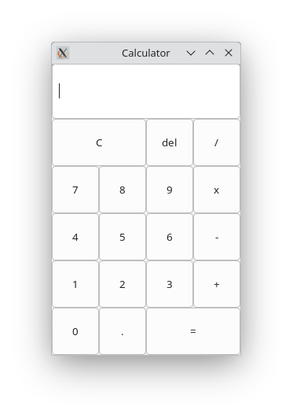
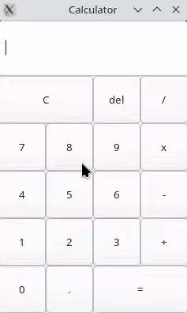

## What is this?
This is a basic calculator app written in C using GTK+ for the UI. It supports simple arithmetic operations like addition, subtraction, multiplication, and division.

## Notes
This is personal project to improve my coding skills, similar to a college project. My main goal was to build it without using any AI or so, All codes here are wrriten by me with depencing on official GTK+ docs, so the code might have some rough edges or suboptimal solutions.

## Screenshots
|  |  |
|:------------------------------:|:------------------------------:|

## How to build

* Install GTK, ref: <https://www.gtk.org/docs/installations/linux>
* `cmake -B build`
* `cmake --build build`

## License

The Apache License 2.0

